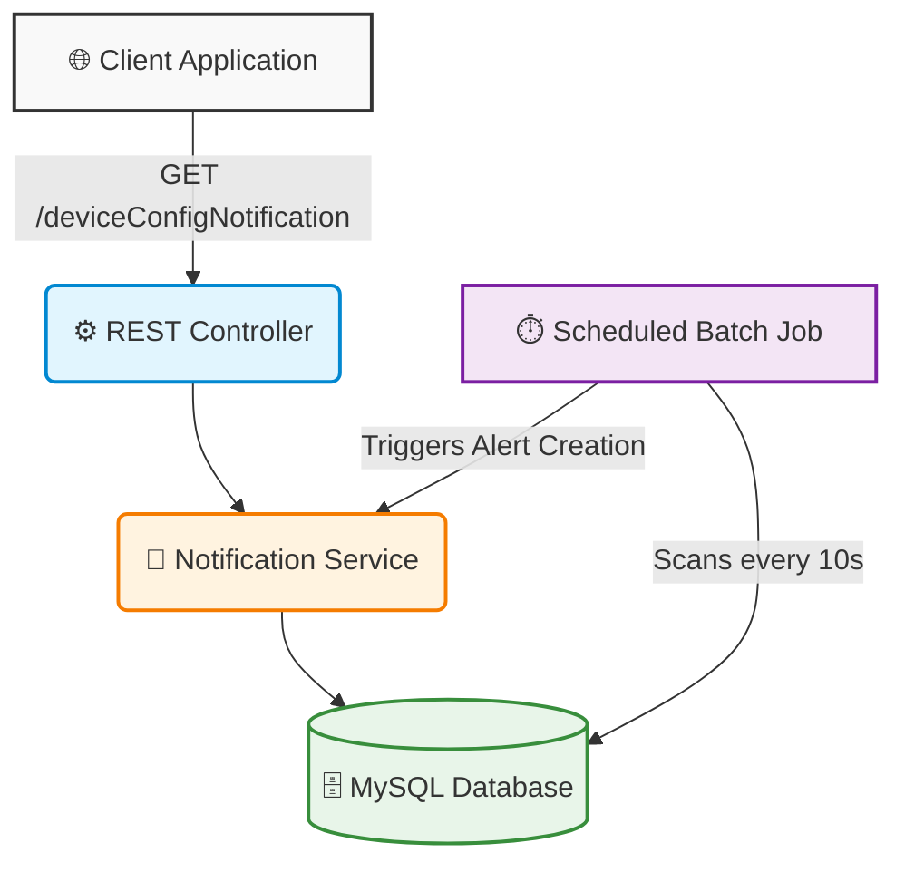

<div align="center">
  
  
  
  <h1>🚀 Device Config Notification System</h1>
  <p><i>A robust, automated Spring Boot service for monitoring and broadcasting device configuration changes.</i></p>
</div>

---

## 📖 Overview

The **Device Config Notification System** is a lightweight, scalable backend service that monitors network devices for any configuration changes. Utilizing a background scheduled batch job, it automatically detects state changes and makes them available via a clean, unified RESTful API.

## ✨ Key Features

- 🔄 **Automated Polling Job:** A built-in scheduler checks for configuration modifications every 10 seconds.
- ⚡ **RESTful Architecture:** Exposes a seamless endpoint `/deviceConfigNotification` to retrieve pending notifications.
- 🗄️ **Relational Persistence:** Leverages Spring Data JPA and MySQL for robust device state tracking.
- 🛠️ **Modern Stack:** Built on **Java 21** and the latest **Spring Boot** capabilities.

---

## 🏛️ Architecture Diagram

The system operates on a straightforward flow, constantly polling the database and serving clients on demand.



---

## 🚀 Getting Started

### 📋 Prerequisites

Ensure you have the following installed locally:
- **Java 21** (or higher)
- **Maven** (optional, you can use the provided `./mvnw` wrapper)
- **MySQL Database Server**

### ⚙️ Database Configuration

1. Create a database in your MySQL instance (e.g., `device_notification_db`).
2. Navigate to `src/main/resources/application.properties` and update the placeholders with your credentials:

```properties
spring.datasource.url=jdbc:mysql://localhost:3306/YOUR_DATABASE_NAME
spring.datasource.username=YOUR_USERNAME
spring.datasource.password=YOUR_PASSWORD
```

### 🛠️ Build & Run

Clone the repository and spin up the service in seconds!

```bash
# Clean and install dependencies
./mvnw clean install

# Run the Spring Boot application
./mvnw spring-boot:run
```

The server will initialize on `http://localhost:8080`.

---

## 📡 API Reference

For full API schema, endpoints, and DTO structures, please refer to our dedicated **[API Documentation](API.md)**.

### Quick Look: Fetch Notifications
```http
GET /deviceConfigNotification HTTP/1.1
Host: localhost:8080
```
```json
[
  {
    "deviceId": 1,
    "deviceIp": "192.168.1.10",
    "deviceDetails": "Core Router A",
    "message": "Configuration changed for device 192.168.1.10"
  }
]
```

---

<div align="center">
  <i>Developed with ❤️ using Spring Boot</i>
</div>
